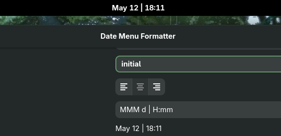
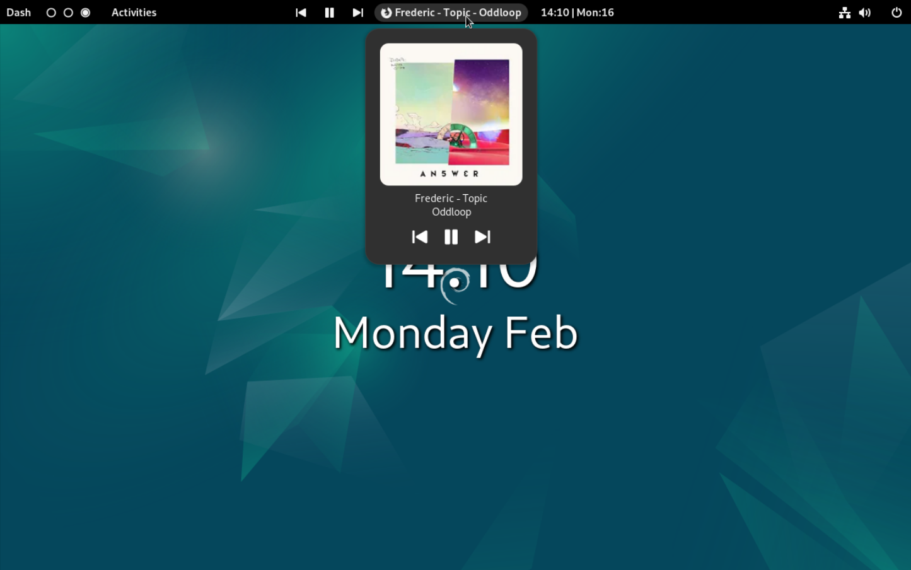
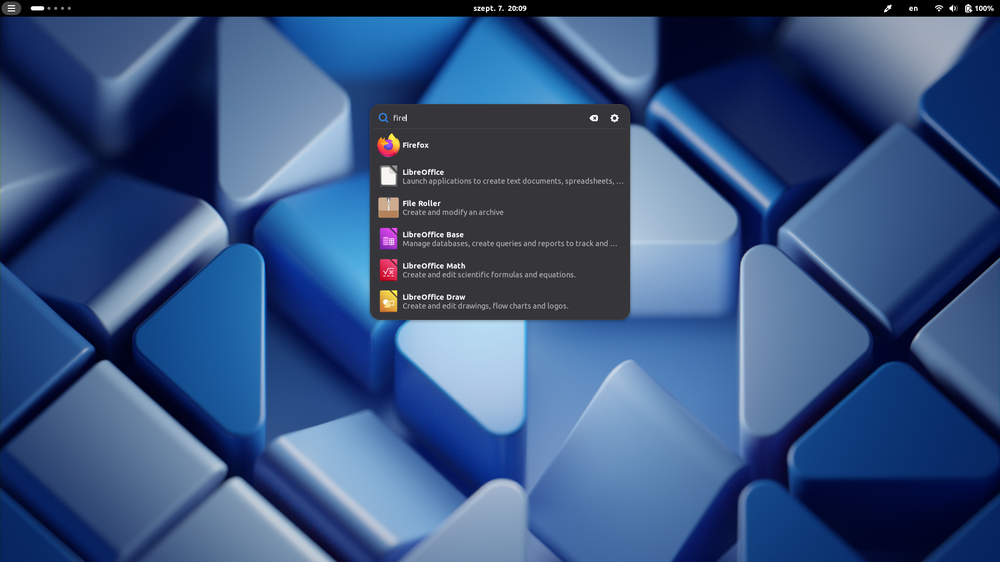
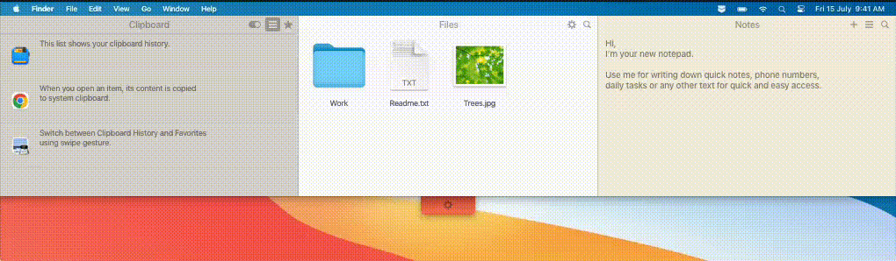
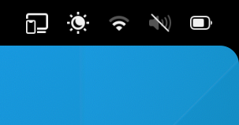
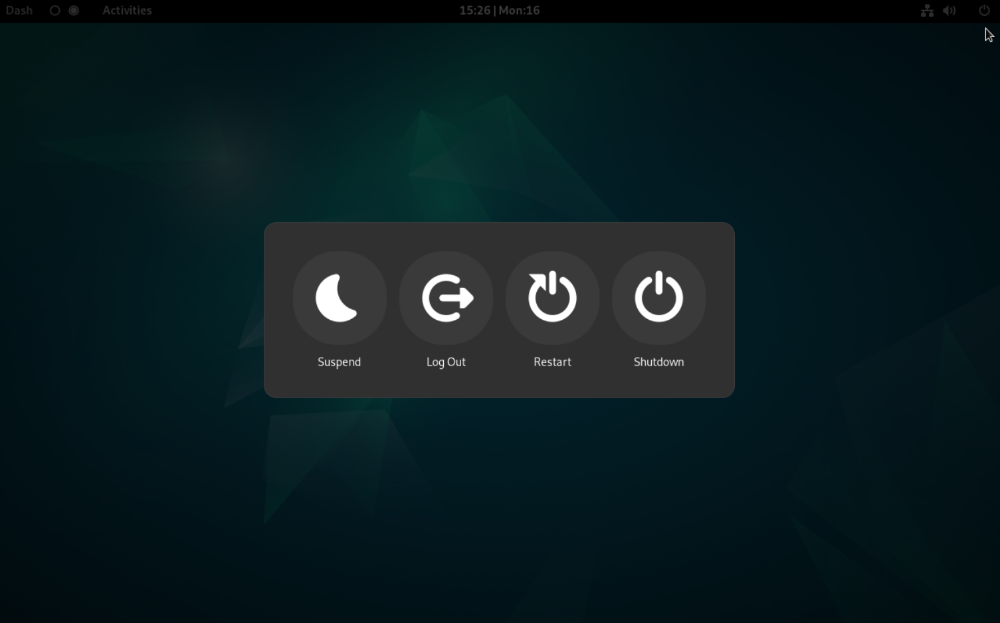
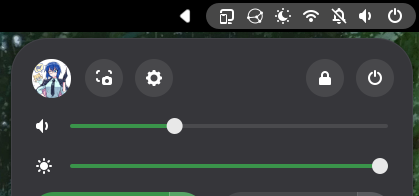
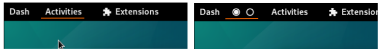
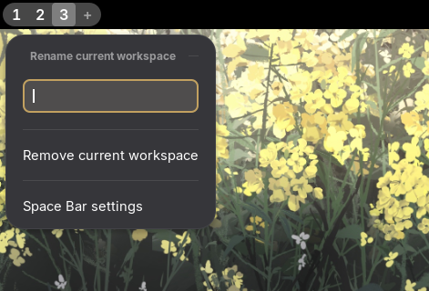

#+TITLE: LIDSoL's Extension Proyect
#+AUTHOR: RamenRoot
#+DATE: 2026-06-25
* 0. Introducción
Este proyecto aborda la modernización e integración de múltiples extensiones para GNOME Shell 50.

EL problema central radica en la fragilidad de las extensiones, que dependen de APIs internas sujetas a cambios, lo que genera obsolescencia: las actualizaciones del escritorio pueden /romper/ las extensiones.

Se propone usar como base el código de la extensión Aylur's Widgets (compatible hasta GNOME 44), Quick Settings Tweaks y otro puñado de extensiones con el propósito de modernizarlas y unificarlas en una única extensión compatible con GNOME Shell 50.

La arquitectura de la extensión debe facilitar su mantenimiento y se validará mediante métricas objetivas de rendimiento.
* 1. Objetivos
** Objetivos generales
Diseñar, implementar y mantener una extensión modular para GNOME que reinterprete y modernice los componentes de extensiones obsoletas como [[https://extensions.gnome.org/extension/5338/aylurs-widgets/][Aylur's Widgets]] mediante una arquitectura que facilite el mantenimiento, adaptada a los cambios de API de GNOME Shell y GJS. La propuesta no consiste en replicar las extensiones originales, si no en evaluar la vigencia de cada componente en GNOME 50, integrar aquello que siga aportando valor y descartar lo redundante. 
- Garantizar compatibilidad total con GNOME 50
- Rediseñar los módulos bajo el principio de "modularidad estricta"
- Separar estrictamente la lógica de negocio y la capa de presentación (UI).
- Implementar un sistema centralizado de señales
- Implementar Lazy Loading de módulos
- Reducir listeners globales innecesarios y evitar memory leaks 
- Validar consumo de CPU y memoria mediante profiling
- Optimizar el rendimiento y evitar degradación en animaciones del Shell
- Consolidar un backend reusable y extensible. Diseñar un backend MPRIS unificado y reusable
- Diseñar e implementar un framework modular interno
- Documentar formalmente la arquitectura interna y contratos entre módulos
- Minimizar conflictos con extensiones populares
- Publicar la extensión
** Objetivos específicos
*** IN-PROGRESS Ventana de configuraciones
- [ ] Mejorar la organización de los elementos
- [ ] Mejorar la responsividad
  - [ ] View Switcher en "ventana grande" y "View Switcher Bar" en ventana pequeña.
  - [ ] Evitar que el contenido se "pegue" a los switch
*** IN-PROGRESS Core
*** IN-PROGRESS Utils
*** IN-PROGRESS Módulos [3/12] [25%]
**** TODO [#B] Battery Bar :topbar:
DEADLINE: <2026-07-11 Sat>

- Descripción: Indicador alternativo de batería en el Top Bar.
  - Se toma como base uno de los módulos de Aylur's Widgets. Compatible hasta GNOME 44, por lo que será necesario darle mantenimiento para hacerlo compatible con GNOME 50.
- Configuración:
  - Visibilidad de ícono y porcentaje.
  - Dimensiones.
  - Colores dinámicos configurables (batería baja, cargando, normal)
**** TODO [#B] Date Menu (dinámico) :topbar:
DEADLINE: <2026-07-11 Sat>
- Descripción: Basado en [[https://www.androidauthority.com/pixel-launcher-at-a-glance-widget-visibility-update-3597606/][el widget At a Glance de los Google Pixel]]. El texto del "Date Menu" cambia dinámicamente, muestra el contenido multimedia que se reproduce actualmente e indica de notificaciones.
***** Date Menu Formatter :topbar:

- Descripción: Permite la personalización del formato de la fecha y hora en el panel.
  - Aylur's Widget tiene un componente que permite personalizar esto, también se tomará como referencia el código de la extensión [[https://extensions.gnome.org/extension/4655/date-menu-formatter/][Date Menu Formatter de Marcin Jakubowski]]. Esta última compatible hasta GNOME 50, por lo que no debería ser difícil integrarla.  
***** Media Player

- Descripción: Controles multimedia integrados en el Date Menu ó Top Bar. El indicador no es visible al menos que se reproduzca contenido multimedia, tomando el lugar del Date Menu.
  - Para usar como base, se pueden tomar en cuenta todas las siguientes implementaciones:
    - [[https://extensions.gnome.org/extension/4928/mpris-label/][Media Label and Controls (por moon-0xff)]], compatible hasta GNOME 49.
    - [[https://extensions.gnome.org/extension/9334/dynamic-music-pill/][Dynamic Music Pill (por andbal)]], compatible hasta GNOME 50.
    - [[https://extensions.gnome.org/extension/4470/media-controls/][Media Controls (por Sakith B.)]], compatible hasta GNOME 49.
    - [[https://extensions.gnome.org/extension/9184/advanced-media-controller/][Advanced Media Controller (por sanjai)]] compatible hasta GNOME 50.
- Objetivos:
- [ ] Mostrar información de pista.
- [ ] Controles (anterior, pausa, siguiente)
- [ ] Separar estrictamente el estado y la representación visual. 
- [ ] Selección de reproductor preferido o descartados
- [ ] Gestionar caché (portada de álbumes)
- [ ] Widget de reproducción multimedia personalizable accesible desde el DateMenu
***** Notification Indicator
- Descripción: Indicador de notificaciones (contador numérico). 
**** TODO [#B] Dashboard 
DEADLINE: <2026-07-08 Wed>
**** IN-PROGRESS [#C] Desktop Widgets :shell:
DEADLINE: <2026-07-11 Sat>
***** IN-PROGRESS Image Widget
***** Clock Widget
***** Weather Widget
**** TODO [#B] Gnofi :shell:
DEADLINE: <2026-07-08 Wed>

- Descripción: Un launcher extensible, selector, buscador y paleta de comandos para GNOME. Añade un ícono al top bar que despliega el lanzador.
  - Se usará como base el código de [[Gnofi de Aylur]]. Es compatible hasta GNOME 49, no debería ser difícil darle el mantenimiento para darle compatibilidad con GNOME 50.
**** DONE Quick Settings Tweaks [3/3] :quicksettings:
- Descripción: Permite configurar los ajustes rápidos, adaptación parcial de [[https://github.com/qwreey/quick-settings-tweaks][Quick Settings Tweaks]]:
- [X] System Items
- [X] Quick Settings
- [X] Overlay Mode
**** IN-PROGRESS [#B] Quick Text [1/4] :shell:
DEADLINE: <2026-07-08 Wed>
- Descripción: Un atajo de teclado (Ctrl+Super+i, aunque es personalizable) abre una ventana de diálogo desde la cual podemos escribir contenido que se insertará en algún alchivo de texto plano de nuestra preferencia; podemos configurar un prefijo o sufijo al texto insertado. Es útil para tomar notas rápidas, fragmentos de texto y anotar ideas; puede usarse como complemento a cualquier app de notas basada en texto plano. El nombre y la ruta de acceso al archivo de destino deben establecerse antes de utilizar la extensión y el archivo debe existir.
  - Se usa como base el código de la extensión *Quick Text* de *Brainstormtrooper*. Esta extensión es compatible hasta GNOME 47, por lo que será necesario darle mantenimiento para darle compatibilidad con GNOME 50.
    - [[https://github.com/brainstormtrooper/quicktext][QuickText (GitHub)]]
    - [[https://extensions.gnome.org/extension/5892/quick-text/][QuickText (Extension.Gnome)]]
- [X] Darle soporte a GNOME 50 e integrar la extensión a LIDSoL's Extensión
- [ ] Mejorar la configuración de atajos de teclado
- [ ] Cambiar el orden de los botones: Ok, Actions, Cancel
- [ ] Configuración para tener o no salto de línea en el prefijo/sufijo

La /primera versión/ será solamente adaptar y actualizar a GNOME 50 QuickText, pero, posteriormente sería interesante implementar algo similar a [[https://unclutterapp.com/][unclutter]]:

Para ello, se puede tomar como base la extensión [[https://github.com/boerdereinar/copyous][copyous]].
**** DONE Panel Corners [1/1] :topbar:

- Descripción: Añade esquinas redondeadas en la top bar.
  - Se usa como base el código de la extensión [[https://github.com/aunetx/panel-corners][Panel Corners de Aunetx]].
  - Esta extensión es compatible con GNOME 50, por lo que será fácil de integrar.
- [X] Integrar la extensión a LIDSoL'S Extension
**** TODO [#A] Power Menu
DEADLINE: <2026-07-04 Sat>

- Descripción: Botón personalizable con diálogo de apagado. Este es de los módulos más simples, por lo que puede ser ideal para implementar al inicio.
  - Se toma como base uno de los módulos de Aylur's Widgets.
  - Compatibilidad hasta GNOME 44, por lo que _será necesario darle mantenimiento_ para hacerlo compatible con GNOME 50.
- [ ] Configuraciones
  - [ ] Posición
  - [ ] Layout (2x2 o 1x4)
  - [ ] Tamaño y redondez
  - [ ] Padding y espaciado
  - [ ] Fondo del díalogo
**** IN-PROGRESS [#A] Top Bar Organized :topbar:
DEADLINE: <2026-07-04 Sat>
- Descripción: Permite cambiar la ubicación de los elementos en el Top Bar. Compatible hasta GNOME 50, así que será fácil de integrar.
  - Se usa como base el código de la extensión Top Bar Organized de June:
    - [[https://extensions.gnome.org/extension/4356/top-bar-organizer/][Top Bar Organized (extensions.gnome)]]
    - [[https://gitlab.gnome.org/june/top-bar-organizer][Top Bar Organized (gitlab)]]
**** DONE User Avatar In Quick Settings [1/1] :quicksettings:

- Descripción: Añade el avatar del usuario al Quick Settings, junto a la configuración relacionada con el sistema.
  - Se usará como base el código de la extensión [[https://github.com/d-go/quick-settings-avatar][Quick Settings Avatar de d-go]], esta es compatible hasta GNOME 50, por lo que su integración debería ser sencilla.
- [X] Integrarla a LIDSoL's Extension.
**** IN-PROGRESS [#B] Workspace Indicator [2/3] :topbar:

- Descripción: Indicador de espacios de trabajo, ofrece una alternativa más configurable que la píldora nativa. Aylur's Widgets incluye un módulo indicador de espacios de trabajo, pero está diseñado para GNOME 44, en versiones posteriores del DE este indicador queda obsoleto.

  
  - Pero, se puede tomar como base la extensión [[https://extensions.gnome.org/extension/5090/space-bar/][SpaceBar de luchrioh]], simplificarla, añadirle animaciones de transición entre espacios de trabajo e integrarla a LIDSoL's Widgets. Space Bar es compatible con GNOME 50, por lo que su integración debería ser sencilla.
- [X] Integrar la extensión a LIDSoL's Widgets
- [ ] Añadir una opción para usar el color de acento de GNOME como color de fondo del espacio activo.
- [X] Añadir animaciones de transición cuando se cambia de espacio de trabajo.
  - [X] Animación similar a la píldora nativa.
  - [X] Animación más "agresiva"
* 2. Arquitectura propuesta
** Estructura de directorios
#+BEGIN_SRC bash
Gnome-Widgets/
├── extension.js                 # Punto de entrada principal
├── metadata.json                # Configuración GNOME 50
├── prefs.js                     # Ventana de preferencias
├── LICENSE                      # GPL-3.0
├── README.md                    # Documentación
├── .gitignore
│
├── extension/
│   ├── core/
│   │   ├── moduleLoader.js      # Sistema de carga dinámmica
│   │   ├── signalManager.js     # Gestor central de signals (Gtk)
│   │   ├── settingsManager.js   # Wrapper para dconf/gsettings
│   │   └── logger.js            # Sistema de logging
│   │
│   ├── modules/
│   │   ├── batteryBar/
│   │   │   ├── module.js        # Interfaz estándar
│   │   │   ├── batteryBar.js    # Lógica
│   │   │   ├── batteryBar.css   # Estilos
│   │   │   └── settings.json    # Config por defecto
│   │   │
│   │   ├── powerMenu/
│   │   │   ├── module.js
│   │   │   ├── powerMenu.js
│   │   │   ├── powerMenu.css
│   │   │   └── settings.json
│   │   │
│   │   ├── notificationIndicator/
│   │   ├── panelCorners/
│   │   ├── workspaceIndicator/
│   │   ├── mediaPlayer/
│   │   ├── dashboard/
│   │   ├── backgroundClock/
│   │   ├── quickText/
│   │   └── _template/           # Template para nuevos módulos
│   │
│   └── utils/
│       ├── mprisService.js      # Interfaz MPRIS D-Bus
│       ├── layoutHelpers.js     # Helpers para UI
│       ├── gsettingsHelper.js   # Wrapper más avanzado
│       └── dBusHelper.js        # Utilidades D-Bus
│
├── schemas/
│   └── org.gnome.shell.extensions.gnome-widgets.gschema.xml
│
├── docs/
│   ├── DEVELOPMENT.md           # Guía de desarrollo
│   ├── MODULE_API.md            # API estándar de módulos
│   └── GNOME50_MIGRATION.md     # Notas para GNOME 50
│
└── tests/
    ├── core/
    └── modules/
#+END_SRC
** Core Framework
*** Module Loader
- Carga y descarga dinámica de módulos
- Activación condicional según configuración
- Gesitón de dependencias internas
*** Signal Manager
- Registro centralizado
- Desconexión automática en disable().
- Prevención de memory leaks.
*** Settings Manager
- Wrapper sobre GSettings.
- Observadores desacoplados.
- Actualización reactiva controlada.
*** Logger
* 4. Notas técnicas de cada commit:
** 9f879cf
- El día de ayer se añadió "correctamente" systemItems.js, pero hoy al intentar usar esta feature, dejó de funcionar. Así que se volvió a portar. Se hicieron los siguientes cambios:
  1. _getItems() siempre usaba GLib.idle_add incluso si _systemItem ya existía: Fast-path síncrono: si systemItem ya está disponible, resuelve inmediatamente sin idle_add
  2. Errores silenciosos invisibles infinitos — el catch devolvía SOURCE_CONTINUE sin log: console.warn() en el catch del idle poller para diagnosticar
  3. Múltiples operaciones async concurrentes si cambiaban settings rápido: _pending guard: _cancelPending() elimina el idle callback anterior antes de crear uno nuevo
  4. _maid.clear() se llamaba pero _getItems() podía resolver con items undefined, que hideJob() ignoraba silenciosamente: Todos los hideJob() protegidos con && items.xxx
  5. Sin forma de cancelar idle_add en disable(): _cancelPending() en disable()
  6. _disconnectHandlers() podía fallar si _gsettings era null: Guard null en _disconnectHandlers()
- Aun así, seguía sin funcionar. Ahí fue cuando me di cuenta de que, si Quick Toggles Layout estaba activado, System Items Layout funcionaba; pero sí se desactivaba Quick Toggles Layout, System Items Layout dejaba de trabajar. El problema estaba en que ModuleLoader registraba todo quickSettingsTweaks con enableKey: 'qst-toggles-enabled', por lo que al desactivar Quick Toggles Layout se descargaba el módulo entero, incluyendo System Items Layout.
  - Cambios realizados:
    1. Nuevo módulo independiente extension/modules/systemItems/module.js — wrapper que crea un SystemItemsFeature como módulo autónomo.
    2. extension/modules/quickSettingsTweaks/module.js — eliminado SystemItemsFeature y su import; ahora solo gestiona QuickTogglesFeature.
    3. extension/core/moduleLoader.js — agregado SystemItemsModule en REGISTERED_MODULES con enabledKey: 'qst-system-items-enabled', separado del módulo de Quick Toggles.
- El tamaño predefinido de la ventana de configuración prefs.js se cambió a a 495x600 
Flujo de activación (dos niveles)
1. ModuleLoader verifica qst-toggles-enabled → si true, crea QuickSettingsTweaksModule
2. QuickSettingsTweaksModule.enable() crea SystemItemsFeature y llama a su enable()
3. SystemItemsFeature.enable() lee qst-system-items-enabled → si false, conecta handlers pero no aplica layout
4. Cuando el usuario activa qst-system-items-enabled desde preferencias, el handler changed:: dispara _scheduleApply()
** f487daa
- Los atajos de teclado para activar/desactivar los toggles personalizados no funcionaban correctamente.
- **Keybinding de custom toggles migrado a `Main.wm.addKeybinding()`**:
  - Reemplazado `global.display.connect('key-press-event', ...)` por `Main.wm.addKeybinding()` con slots GSettings (`qst-custom-kb-0` a `qst-custom-kb-9`), más estable y sin necesidad de parsear aceleradores manualmente.
  - `_destroyCustomToggles()` ahora usa `Main.wm.removeKeybinding()` en vez de `global.display.disconnect()`.
  - Cada toggle guarda `kbSlot` y `kbRegistered` en vez de `keybindingId`.
- **10 nuevas keys GSettings** en el schema: `qst-custom-kb-0` a `qst-custom-kb-9` (tipo `as`, default `[]`).
- **Reorganización de la página Quick Settings en prefs.js**:
  - Separado en dos `Adw.PreferencesGroup`: "Área de sistema" (User Avatar + System Items) y "Toggles" (Quick Toggles Layout).
  - Intercambiado el orden de las filas System Items ↔ Quick Toggles para que cada una quede en su grupo correcto.
** 3876e7e 
- Comportamiento de incicio corregido en quickToggles.js.
  - `LidSolToggleIndicator` ahora aplica `config.initialState` (0=On, 1=Off, 2=Previous, 3=Command output) al crearse, no solo confiaba en `_toggleState` (vacío al iniciar sesión).
  - Agregado `runAtBoot` con retardo: si `item.runAtBoot` es true, programa el comando ON/OFF según el estado resultante con `delayTime` segundos de espera.
  - Persistencia de estado en GSettings (`qst-custom-state-0..9`): cada toggle guarda su estado booleano al hacer clic, permitiendo que "Estado anterior" (initialState=2) funcione entre sesiones.
  - Schema — 10 nuevas keys qst-custom-state-0..9. Tipo b (boolean), default false. Siguen el mismo patrón que los slots de keybinding.
** 84cb3b9
- Mejoras en prefes.js:
  - /getIconName()/ ahora retorna /item-icon/ si está definido, mostrando el ícono real del toggle en la lista de ordenamiento.
  - Priview en vico del ícono en el formulario de edición (se actualiza al escribir).
  - Una nueva fila de "Sugerencias" con ejemplos de íconos y encace al repo de gitlab con los íconos simbólicos.
- **Script de test Syncthing** (`scripts/syncthing-toggle.sh`) — Ejercita todos los campos de configuración de toggles personalizados:
  - `commandOn` / `commandOff` / `checkCommand` / `checkRegex` / `checkExitCode` / `commandSync`. Este solo es para testar, despues se eliminará.
** 2bb9dce
- Se edito la ventana de configuraciones, prefes.js, ambos *botones de restablecer* ahora muestran un Adw.AlertDialog de confirmación con respuesta destructiva antes de procedes. Es para evitar eliminar tus configuraciones por error.
- Se editó quickToggles.js, había un error en el *reordenamiento en vivo* de los toggles personalizados, /_reload()/ ahora llama a /_onUpdate/ después de crear los toggles personalizados, para poder editar el orden de los quick settings.
** 70c84ca
- Se hizo un port de Overlay Mode desde Quick-Settings-Tweaks.
  - Se creo /extension/modules/quickSettingsTweaks/overlayMenu.js/ con /OverlayMenuFeature/.
  - Se usa /QuickSettingsMenuTracker/ para hookear creación/apertura de menús de toggles.
  - Animaciones: flyout (/EASE_OUT_BACK/) y dialog (/EASE_OUT_EXPO/).
  - Recálculo dinámico de Y offset al cambiar altura del menú.
  - Preferencias en Quick Settings -> Toggles -> Overlay Mode (ancho, duración, estilo, alclaje).
- 5 nuevas keys GSettings: /qst-overlay-menu-*/
- [X] Agregada clase /QuickSettingsMenuTracker/ faltante en /extension/utils/childrenTracker.js/
- /overlayMenu.js/ importaba /QuickSettingsMenuTracker/ desde /childrenTracker.js/, pero no existía → SyntaxError
- Implementación: wrapper sobre /QuickSettingsToggleTracker/ que, por cada toggle con propiedad /.menu/, conecta /notify::isOpen/ y expone /onMenuCreated/onMenuOpen/
- Ciclo de vida gestionado via /Maid/ (se limpia al destruirse el toggle)
** 896629c 
- [X] Fix, bug de posicionamiento en X. El overlay aparecía en x=0 en vez de alineado con QuickSettings.
  - Causa raíz: el `_xconstraint` usaba `menu.box` como source (coordenadas relativas al padre), no `menu._boxPointer` (coordenadas stage-absolutas). Además nunca se actualizaba `_xconstraint.offset`.
  - Cambios en `/extension/modules/quickSettingsTweaks/overlayMenu.js`:
    1. `_xconstraint.source` cambiado de `menu.box` → `menu._boxPointer` (mismo source que Y)
    2. `_onOpen()` ahora setea `_xconstraint.offset = coords.offsetX`
    3. `_onMenuCreated()` añade `menu.actor.x_align = Clutter.ActorAlign.CENTER` al fijar width
    4. Handler `notify::height` ahora también actualiza `_xconstraint.offset`
** 3a2f272
- overlayMenu.js
  - Posición X: _xconstraint vinculado a menu._boxPointer (no menu.box), y su offset se actualiza en _onOpen() y en notify::height.
  - x_align = CENTER: al fijar menu.actor.width para que el menú se centre dentro del overlay.
  - AdvAni.ease(): flyout usa LowBackover bezier (0.225, 1.2, 0.45, 1), dialog usa MiddleBackover (0.4, 1.35, 0.55, 1).
  - Handlers siempre conectados: _connectHandlers() movido antes del if (!this._enabled) return.
  - Live keys: duration, style, overflow anchor ya no hacen reload completo, solo _loadSettings().
  - _scheduleReload() captura gsettings: evita que disable() (que setea _gsettings = null) rompa el enable() posterior.
- childrenTracker.js
  - QuickSettingsMenuTracker refactorizado: ahora extiende ChildrenTrackerBase directamente (como QST), monitorea _grid con child-added y detecta child.menu.
  - open-state-changed en vez de notify::isOpen — es la señal nativa de QuickSettingsMenu.
  - .menus getter (en vez de .items) que retorna las claves del appliedChild Map.
- advani.js
  - Nuevo archivo utility con AdvAni.ease(actor, params) que aplica custom cubic-bezier curves.
  - Dos modos: LowBackover y MiddleBackover, definidos como ModeDefine con puntos de control Graphene.
  - Tras llamar a actor.ease(), busca los transitions por key y llama set_cubic_bezier_progress() para sobrescribir la interpolación.
** bb029de
- schemas/…gschema.xml: nueva key ws-transition-animation (enum: none/subtle/aggressive)
- settings.js: transitionAnimation Subject agregado
- workspacesBar.js: 
- _updateWorkspacesBar() → distingue cambio estructural (_fullRefresh) vs cambio de activo (_updateInPlace)
- _updateInPlace() actualiza styleClass y texto sin destruir actores
- _animateEnter() aplica escala con easing: Subtle 0.95→1.0 (EASE_OUT_QUAD, 200ms), Aggressive 0.7→1.15 bounce (EASE_OUT_BACK, 150ms) luego a 1.0 (EASE_OUT_QUAD, 100ms)
- prefsSettings.js: combo «Animación de transición» en grupo Apariencia
** cbfae79
- Bugfix: _updateInPlace() usaba referencia obsoleta de _dragHandler.wsBoxes — workspace.name no se actualizaba al renombrar. Fix: leer de this._ws.workspaces[workspace.index]
- Bugfix: ease() race condition — dos wsBox.ease() consecutivos sobre las mismas propiedades (scale_x, scale_y) no encadenan; el segundo reemplaza al primero antes del primer frame. Fix: onComplete callback para secuenciar.
- Fix: wsBox.remove_all_transitions() antes de cada animación para cancelar transiciones pendientes por cambios rápidos de workspace. label.remove_all_transitions() en fade.
- fade: animación sobre label (opacity 0→255, EASE_OUT_QUAD, 250ms)
- pulse: dos fases onComplete — scale 1.0→1.1 (EASE_OUT_QUAD, 140ms) → 1.1→1.0 (EASE_OUT_CUBIC, 180ms)
- aggressive: corregido con onComplete (mismos parámetros, ahora secuencial limpio)
** 7f8c563
- Renombrado extension/modules/backgroundClock/ → backgroundWidgets/
- Extraída clase ClockWidget a clockWidget.js (antes BackgroundClockWidget dentro de module.js)
- module.js convertido en orquestador: importa ClockWidget desde clockWidget.js
- moduleLoader.js actualizado: import BackgroundWidgetsModule, id 'backgroundWidgets', name 'Background Widgets', enabledKey 'background-clock-enabled' (retrocompatible)
- prefs.js: descripción de categoría Widgets actualizada
- Schema GSettings sin cambios (claves background-clock-* intactas)
** 4fab644
- Creado extension/modules/backgroundWidgets/baseWidget.js con clase DesktopWidget (extends St.Widget):
  - _addToBackgroundGroup(): se inserta en Main.layoutManager._backgroundGroup
  - _setupOverviewFade(): conecta notify::value de overview._controls._stateAdjustment → opacity = 255 * (1 - value)
  - _removeOverviewFade(): desconecta la señal en destroy()
  - _init() llama a ambos automáticamente
- ClockWidget ahora extiende DesktopWidget en vez de St.Widget directamente
- module.js simplificado: ya no agrega manualmente el widget al container (lo hace DesktopWidget._init)
- Bugfix: DesktopWidget._init usa arrow function en connect('destroy') en vez de this._onDestroy.bind(this) — las subclases (ClockWidget) sobrescriben _onDestroy, la arrow function preserva el handler de la base
- moduleLoader.js y prefs.js sin cambios respecto a checkpoint-0
** f101246
- Creado extension/modules/backgroundWidgets/pictureWidget.js con clase PictureWidget (extends DesktopWidget):
  - CSS background-image: url("file://...") con background-size: cover
  - Soporta imagen única o carpeta con selección aleatoria (recursiva en subdirectorios)
  - Tamaño base + aspect ratio → ancho/alto calculados
  - Posición raw x/y (píxeles desde esq. sup. izq.)
  - Corner radius porcentual sobre la dimensión menor
  - Auto-refresh timer (GLib.timeout_add_seconds) para rotar imágenes de carpeta
  - Destroy handler limpia refreshId
- Agregadas 8 keys GSettings al schema unificado (prefijo pw-):
  - pw-enabled (bool, master toggle, default false)
  - pw-image-path (string, ruta archivo o carpeta)
  - pw-size (int, 10-2000, default 200)
  - pw-aspect-ratio (double, 0.1-10, default 1.0)
  - pw-position-x/y (int, default 100)
  - pw-corner-radius (int, 0-100, default 20)
  - pw-refresh-interval (int, 0-86400, default 60)
- module.js actualizado: gestiona ClockWidget y PictureWidget con toggles independientes (background-clock-enabled + pw-enabled) mediante watchers GSettings runtime
- Schema compilado (glib-compile-schemas)
** 2491e88
- prefs.js _addWidgetsModuleGroup: agregado createModuleRow para pw-enabled (Picture Widget) antes de Background Clock
- Creado _buildPictureWidgetDialog() con grupos:
  - Imagen: folder chooser con Gtk.FileChooserDialog (SELECT_FOLDER)
  - Tamaño: tamaño base + aspect ratio (SpinButton con digits=2)
  - Posición: X, Y en píxeles
  - Apariencia: corner radius porcentual
  - Avanzado: refresh interval (0 = sin auto-refresh)
- Schema compilado
- Bug: Picture Widget solo funcionaba si Background Clock estaba activo, porque ambos dependían de que ModuleLoader cargara backgroundWidgetsModule en base a background-clock-enabled
- Solución: nuevo GSettings key background-widgets-enabled (bool, default true) como master toggle
- moduleLoader.js: enabledKey cambiado de background-clock-enabled a background-widgets-enabled
- module.js sin cambios — ya gestiona sub-toggles independientes (background-clock-enabled + pw-enabled)
- prefs.js _addWidgetsModuleGroup: agregado master switch al inicio, sub-toggles con sensitiveBind
- prefsHelpers.js createModuleRow: agregado parámetro sensitiveBind
** 4c2c1e2
Ahora la animación face al ingresar al overview es visible. Y el widget es persistente durante el cambio de workspace.
- Bug raíz: widget en _backgroundGroup → overview overlay (semi-transparente) lo cubría→cambios de opacidad invisibles. Además _backgroundGroup se reestructura al cambiar workspace.
- Solución: Migrar de _backgroundGroup a Main.layoutManager.uiGroup como padre. Widget se renderiza SOBRE el overlay del overview (visible durante transición). uiGroup no se reestructura al cambiar workspace → widget persistente.
- Mecanismo fade: monkey-patch de WorkspaceBackground.prototype._init + notify::value en _stateAdjustment (por-background, DING-style), sin filtro _isOverviewTransition(), sin initial-opacity en conexión. Adj.value 0→1 → opacity 255→0 progresivo, cuadro por cuadro.
- raiseToTop: idle_add set_child_above_sibling(this, null) para mantener widget sobre el overview.
- Eliminados: _setupWorkspaceHandlers (switch-workspace + active-workspace-changed), _reparentAfterSwitch, _isOverviewTransition(), initial-opacity set.
- Referencia desktop-icons-ng: usa ventana real (Gtk) fuera del árbol Clutter → no sufre ocultación por overlay. Este enfoque (Clutter en uiGroup + _stateAdjustment) logra el mismo efecto visual con actores nativos.
** 3a32287
- Implementado módulo topBarOrganizer que permite reordenar y ocultar elementos de la barra superior (panel).
- 6 nuevas keys GSettings con prefijo tbo-:
  - tbo-enabled (bool, default false) — master toggle del módulo
  - tbo-left-box-order, tbo-center-box-order, tbo-right-box-order (as, default []) — orden por caja
  - tbo-hide, tbo-show (as, default []) — ocultar/forzar mostrar items
- module.js: hook de Panel.Panel.prototype._addToPanelBox via Maid.patchJob para interceptar nuevos items. Algoritmo:
  - saveNewTopBarItems(): escanea Main.panel.statusArea, mapea container→role, agrega items desconocidos a GSettings
  - orderTopBarItems(box): reordena hijos de _leftBox/_centerBox/_rightBox vía remove_child + insert_child_at_index, aplica hide/show según tbo-hide/tbo-show
  - Conexión a changed:: de las 5 keys tbo-* para reordenar en vivo
- moduleLoader.js: registrado TopBarOrganizerModule con enabledKey tbo-enabled
- prefs.js: nuevo grupo "Organización del panel" en categoría Top Bar / Panel con:
  - createModuleRow con switch de habilitación + botón "Organizar"
  - Diálogo con 3 secciones (Left/Center/Right), flechas arriba/abajo por item, switch de visibilidad, botón restablecer
  - Mapa de nombres e iconos para items conocidos (appMenu, dateMenu, activities, quickSettings, a11y, keyboard, screencastIndicator, remoteAccessIndicator)
** 3414f12
No se mostraban los ajustes del top-bar-organizer. El error era Adw.PreferencesGroup.get_rows() — no existe en GTK4/Adw. Causaba un TypeError dentro de childrenRequest, lo que impedía que dialog.present() se ejecutara, nunca era visible el dialog que muestra las configuraciones. Se remplazó por un array boxRows que trackea las filas manualmente.
** 3ab233f
Al ocultar un elemento (switch on), se ocultaba correctamente, pero al intentar mostrarlo nuevamente (switch off), ya no se mostraba, ni desactivando/activando la extensión. La causa era que wasVisible se capturaba después de que se llamara a hide(), ya lo habia puesto en false, y el else if (!wasVisible) lo volvía a ocultar en el reordenamiento. Para soluciar esto se usa mejor una lógica directa: si está en tbo-hide, se oculta, si no se muestra.
** 7e16ea5
Se reemplazaron los botones ↑↓←→ por Gtk.ListBox (tipo drag & drop). Cada fila tiene:
- Asa de arrastre (list-drag-handle-symbolic) + icono + nombre
- Switch de ocultar/mostrar.
- DragSource: al arrastrar, crea un ContentProvider con el tipo TopBarOrganizerRow.$gtype para filtrar solo nuestras filas. drag-begin muestra una copia visual de la fila como icono de arrastre.
- DropTarget: acepta solo filas del mismo tipo. En el drop, calcula la posición correcta (misma caja → reordenar; caja distinta → mover entre cajas) y guarda a GSettings.
- Cross-box: _saveBothListBoxOrders usa settings.delay() + apply() para evitar race conditions con el módulo.
Las 3 cajas están dentro de un solo Adw.PreferencesGroup con Gtk.Label como encabezados de sección, y Gtk.ListBox con estilo boxed-list para la apariencia de lista Adw.
** e09fc44
El Gtk.ListBos ahora tiene:
- set_size_request(-1, 60): ahora hay una altura mínima de 60px aunque esté vacío.
- Gtk.ListBox.set_placeholder(): muestra "arrastrar elementos aquí" en gris atenuado cuando no hay fila. 
Con esto se solucionó un bug que no permitia arrastar elementos a una caja vacía.
** Commit actual
 _saveListBoxOrder ahora usa settings.delay() + settings.apply() como _saveBothListBoxOrders y el switch handler.
