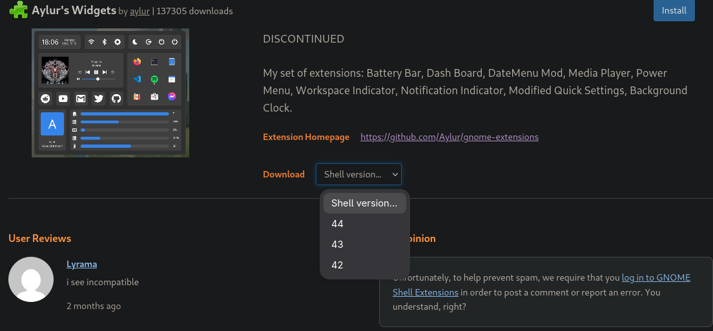
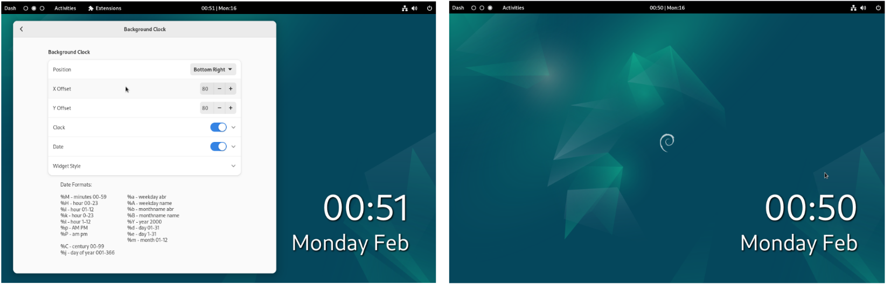
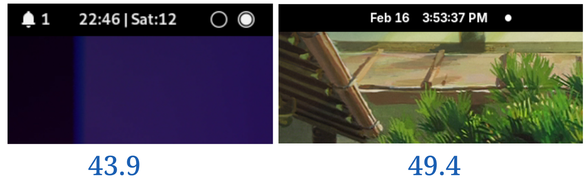
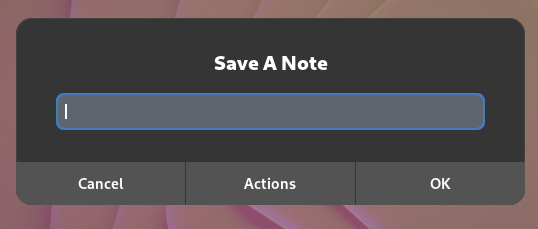

#+TITLE: LIDSoL'S Widgets Proyect
#+AUTHOR: RamenRoot
#+DATE: 12-05-2025
* 0. Introducción
Este proyecto aborda la modernización y unificación de múltiples extensiones de GNOME.

El problema central radica en la fragilidad del ecosistema de extensiones, el cual depende de APIs internas sujetas a cambios, esto genera obsolescencia: las actualizaciones del escritorio /pueden romper/ las extensiones.

Para este proyecto se propone estudiar el código de la extensión Aylur's Widgets (sin mantenimiento desde hace más de un par de años y por lo tanto incompatible con las versiones más recientes del escritorio) y de otro puñado de extensiones, con el propósito de modernizarlas y/o unificarlas en una única extensión compatible con GNOME Shell 50.

El resultado final esperado es una extensión con arquitectura modular, que gestione de forma centralizada las señales, con bajo, coplamiento, "lazy loading", optimizada y control explícito del ciclo de vida de cada componente. Su arquitectura debe facilitar su mantenimiento y se validará mediante métricas objetivas de rendimiento y estabilidad.

* 1. Objetivos
** Objetivos generales
Diseñar, implementar y mantener una extensión modular para GNOME que reinterprete y modernice los componentes de [[https://extensions.gnome.org/extension/5338/aylurs-widgets/][Aylur's Widgets]] , mediante una arquitectura mantenible, adaptada a los cambios de API de GNOME Shell y GJS.

La propuesta no consiste en replicar la extensión original, sino en:
- Evaluar la vigencia funcional de cada componente en GNOME 50.
- Determinar cuáles han sido reemplazados por mejoras nativas del entorno de escritorio.
- Rediseñar los módulos bajo principios de modularidad estricta.
- Optimizar el rendimiento y evitar degradación en animaciones del Shell.
- Consolidar un backend reutilizable y extensible.
- Publicar la extensión
** Objetivos técnicos
- Separar estrictamente la lógica de negocio y la capa de presentación (UI).
- Implementar un sistema centralizado de señales.
- Diseñar e implementar un framework modular interno.
- Implementar Lazy Loading de módulos
- Minimizar conflictos con extensiones populares.
- Diseñar un backen MPRIS unificado y reutilizable.
- Reducir listeners globales innecesarios y evitar memory leaks.
- Garantizar compatibilidad total con GNOME 50.
- Validar consumo de CPU y memoria mediante profiling.
- Documentar formalmente la arquitectura interna y contratos entre módulos.
** PROJECT (objetivos específicos+docs) [0%] [0/4]
*** IN-PROGRESS Ventana de configuración
- [ ] Mejorar la organización de los elementos
- [ ] Mejorar la responsividad
  - [ ] View Switcher en "ventana grande" y "View Switcher Bar" en ventana pequeña.
  - [ ] Evitar que el contenido se "pegue" a los switch
*** IN-PROGRESS Core
*** IN-PROGRESS Utils
*** IN-PROGRESS Módulos [0/14]
**** IN-PROGRESS Backgroud Clock [1/6] :widgets:
- [X] Hacer compatible el módulo de aylur's con GNOME 50 e integrarlo a LIDSoL's Widgets
- [ ] Testear
- [ ] En el contorno del reloj/calendario y en el contenedor del contenedor se ve un márgen negro, muy pequeño, como si fuese una sombra.
- [ ] Añadir una animación suave al ingresar al overview, para que no desaparezca de forma abrupta.
- [ ] Posibilidad de usar el contenedor con color transparente.
- [ ] La posición 0 no funciona adecuadamente.
***** Descripción
  
  - Widget de reloj superpuesto en el escritorio, similar al comportamiento de [[https://github.com/brndnmtthws/conky][conky]].
    - Se permite la configuración del posicionamiento mediante layouts o coordenadas.
    - Personalización de la tipografía, color, tamaño y sombras.
    - Configuración del contenedor: background, padding, bordes, redondeado.
  - Se toma como base uno de los módulos de aylur's widgets
  - Compatibilidad hasta GNOME 44, por lo que _será necesario darle mantenimiento_ para hacerlo compatible con GNOME 50.
- [ ] Analizar conflictos con extensiones como [[https://extensions.gnome.org/extension/5263/gtk4-desktop-icons-ng-ding/][DING (Desktop Icons NG)]].
- [ ] Mejorar el rendimiento (degradación de rendimiento al ingresar al Overview)
  - [ ] Optimizar renderizado evitando bloqueos en animaciones.
  - [ ] Minimizar impacto en la composición gráfica.
**** TODO Battery Bar [0/1] :topbar:widgets:
  - Descripción:
    [[./img/aylurs-battery.png]]
    - Indicador alternativo de batería en el Top Bar. Módulo de baja complejidad técnica y alto impacto visual. Ideal como implementación temprana. Permite configurar:
      - Posición (izquierda, centro, derecha).
      - Visibilidad de ícono y porcentaje.
      - Dimensiones.
      - Colores dinámicos configurables (batería baja, cargando, normal).
    - Se toma como base uno de los módulos de Aylur's Widgets.
    - Compatibilidad hasta GNOME 44, por lo que _será necesario darle mantenimiento_ para hacerlo compatible con GNOME 50.
- [ ] ?
**** TODO Date Menu Formatter [/] :topbar:
  - Descripción:
    - Permite la personalización del formato de la fecha y hora en el panel.
      [[./img/date-format.png]]
    - Aylur's widgets tiene un componente que permite personalizar esto, también se estudiará la extensión [[https://extensions.gnome.org/extension/4655/date-menu-formatter/][Date Menu Formatter de Marcin Jakubowski]].
  - Compatibilidad: Date Menu Format es compatible hasta GNOME 50.
**** TODO Dashboard
Aún es neceario escribir la propuesta
**** TODO Gnofi [0/0] :shell:
  - Descripción
    - Un launcher extensible, selector, buscador y paleta de comandos para GNOME. Añade un ícono al topbar que despliega el lanzador.
      [[./img/gnofi.png]]
    - Se usará como base el código de [[https://github.com/Aylur/gnome-extensions][Gnofi de Aylur]].
    - Es compatible hasta GNOME 49. No debería ser difícil darle el mantenimiendo para darle compatibilidad para GNOME 50.
**** TODO Media Player [0/13] :topbar:widgets:
  - Descripción
    [[./img/aylurs-player.png]]
    - Controles multimedia integrados en el top bar (y en el dash?).
    - Se toma como base uno de los módulos de Aylur's Widgets, pero también se estudiarán otras implementaciones:
      - [[https://extensions.gnome.org/extension/4928/mpris-label/][Media Label and Controls (por moon-0xff)]], compatible hasta GNOME 49.
      - [[https://extensions.gnome.org/extension/9334/dynamic-music-pill/][Dynamic Music Pill (por andbal)]], compatible hasta GNOME 50.
      - [[https://extensions.gnome.org/extension/4470/media-controls/][Media Controls (por Sakith B.)]], compatible hasta GNOME 49.
      - [[https://extensions.gnome.org/extension/9184/advanced-media-controller/][Advanced Media Controller (por sanjai)]], compatible hasta GNOME 50.
  - Objetivos: 
  - [ ] Mostar información de pista.
  - [ ] Controles (anterior, pausa, siguiente).
  - [ ] Widget Desplegable configurable.
  - [ ] Selección de reproductor preferido.
  - [ ] Evitar duplicidad entre el reproductor del Top Bar, del panel de notificaciones y del QuickSettings.
  - [ ] Separar estrictamente el estado y la representación visual.
  - [ ] Gestionar caché
**** TODO Notificacion Indicator [0/1] :topbar:
- Descripción:
  - Indicador de notificaciones con contador numérico. GNOME Incluye un indicador visual de notificaciones, pero no contador cuantitativo. 
    
  - Se toma como base uno de los módulos de Aylur's Widgets.
  - Compatibilidad hasta GNOME 44, por lo que será necesario darle mantenimiento para hacerlo compatible con GNOME 50.
- [ ] Configuraciones
  - [ ] Posición
  - [ ] Offset
  - [ ] Estilo (ícono o contador)
  - [ ] Máximo de íconos
  - [ ] Visibilidad del contador
**** IN-PROGRESS Panel Corners [0/2] :topbar:
- Descripción:
  [[./img/panel-corners.png]]
  - Añade esquinas redondeadas en la tob bar.
  - Se usa como base el código de la extensión *Panel Corners* de *Aunetx*:
    - [[https://extensions.gnome.org/extension/4805/panel-corners/][Panel Corners (extensions.gnome)]]
    - [[https://github.com/aunetx/panel-corners][Panel Corners (github)]]
  - Esta extensión es _compatible con GNOME 50_, por lo que será fácil de integrar.
- [ ] Integrar la extensión a LIDSoL's Widgets.
**** TODO Power Menu [0/1] :shell:
- Descripción
  - Botón personalizable con diálogo de apagado. Este es de los módulos más simples, por lo que puede ser ideal para implementar al inicio.
    [[./img/aylurs-power.png]]
  - Se toma como base uno de los módulos de Aylur's Widgets.
  - Compatibilidad hasta GNOME 44, por lo que _será necesario darle mantenimiento_ para hacerlo compatible con GNOME 50.
- [ ] Configuraciones
  - [ ] Posición
  - [ ] Layout (2x2 o 1x4)
  - [ ] Tamaño y redondez
  - [ ] Padding y espaciado
  - [ ] Fondo del díalogo
**** IN-PROGRESS Quick Settings Tweaks
*****  Aún es necesario escribir la propuesta
**** IN-PROGRESS Quick Text [1/3] :shell:
- [X] Darle soporte a GNOME 50 e integrar la extensión de LIDSoL's widgets 
- [ ] Mejorar la configuración de atajos de teclado
- [ ] Cambiar el orden de los botones Ok, Actions, Cancel
***** Descripción
  - Un atajo de teclado (Ctrl+Super+i, aunque es personalizable) abre una ventana de diálogo desde la cual podemos escribir texto que se insertará en algún alchivo de texto plano de nuestra preferencia; podemos configurar un prefijo o sufijo al texto insertado. Es útil para tomar notas rápidas, fragmentos de texto y anotar ideas; puede usarse como complemento a cualquier app de notas basada en texto plano. El nombre y la ruta de acceso al archivo de destino deben establecerse antes de utilizar la extensión y el archivo debe existir.
      
  - Se usa como base el código de la extensión *Quick Text* de *Brainstormtrooper*:
    - [[https://github.com/brainstormtrooper/quicktext][QuickText (GitHub)]]
    - [[https://extensions.gnome.org/extension/5892/quick-text/][QuickText (Extension.Gnome)]]
  - Esta extensión es compatible hasta GNOME 47, por lo que _será necesario darle mantenimiento_ para darle compatibilidad con GNOME 50
- La primera versión será solamente adaptar a GNOME 50 esta extensión (e integrarla) pero, posteriormente:
  [[./img/unclutter.gif]]
- Inspiración en:
  - [[https://unclutterapp.com/][unclutter]]
  - [[https://github.com/boerdereinar/copyous][copyous]]
- [ ] Historial de portapaleles
- [ ] Vista desplegable estilo panel
**** TODO Top Bar Organized [0/0] :topbar:
- Descripción:
  - Permite cambiar la ubicación de los elementos del topbar.
  - Se usa como base el código de la extensión *Top Bar Organizad* de *June*
    - [[https://extensions.gnome.org/extension/4356/top-bar-organizer/][Top Bar Organized (extensions.gnome)]]
    - [[https://gitlab.gnome.org/june/top-bar-organizer][Top Bar Organized (gitlab)]]
  - Esta extensión es _compatible hasta GNOME 50_, así que será fácil de integrar. 
**** IN-PROGRESS User Avatar In QuickSettings [1/1] :quicksettings:
- [X] Integrar a LIDSoL's Widgets
***** Descripción
    - Añade el avatar del usuario al Quick Settings, junto a la configuración relacionada con el sistema.
      [[./img/avatar.png]]
    - Se usará como base el código de la extensión [[https://github.com/d-go/quick-settings-avatar][Quick Settings Avatar de d-go]]. 
    - Esta extensión es compatible con GNOME 50, por lo que su integración debería ser sencilla.
  - [ ] ? 
**** IN-PROGRESS Workspace Indicator [1/5] :topbar:widgets:
- [X] Integrar la extensión a LIDSoL's Widgets
- [ ] Añadir animaciones de transición entre espacios de trabajo
  - [ ] Animación simiar a la de la píldora nativa
  - [ ] Animación más "agresiva"
- [ ] Añadir una opción para usar el color de acento de GNOME como color de fondo del espacio activo.
- [ ] Modificar los valores de configuración nativos de Space Bar por otros /más atractivos/
- [ ] Testing
***** Descripción
[[./img/aylurs-workspace.png]]
- Indicador de espacios de trabajo: ofrece una alternativa más configurable que la píldora nativa. Aylur's Widgets incluye un módulo indicador de espacios de trabajo, pero está diseñado para GNOME 44, en versiones posteriores queda obsoleto ante el indicador nativo con mejor aspecto. Pero, se puede tomar como base la extensión [[https://extensions.gnome.org/extension/5090/space-bar/][SpaceBar de luchrioh]], simplificarla, añadirle animaciones de transición entre espacios de trabajo e integrarla a LIDSoL's Widgets.
  [[./img/spacebar.png]]
- Space Bae es compatible con GNOME 50, por lo que su integración debería ser sencilla. 
***** Documentación

* 2. Arquitectura propuesta
** Principios de diseño
- "Núcleo", centralizar la gestión de señales y la comunicación con la API.
- Modularidad. Separación de responsabilidades.
- Alta cohesión
- Gestión explícita el ciclo de vida.
- Evitar dependencia directa de APIs internar con poca documentación.
** Estructura de directorios
#+BEGIN_SRC bash
Gnome-Widgets/
├── extension.js                 # Punto de entrada principal
├── metadata.json                # Configuración GNOME 50
├── prefs.js                     # Ventana de preferencias
├── LICENSE                      # GPL-3.0
├── README.md                    # Documentación
├── .gitignore
│
├── extension/
│   ├── core/
│   │   ├── moduleLoader.js      # Sistema de carga dinámmica
│   │   ├── signalManager.js     # Gestor central de signals (Gtk)
│   │   ├── settingsManager.js   # Wrapper para dconf/gsettings
│   │   └── logger.js            # Sistema de logging
│   │
│   ├── modules/
│   │   ├── batteryBar/
│   │   │   ├── module.js        # Interfaz estándar
│   │   │   ├── batteryBar.js    # Lógica
│   │   │   ├── batteryBar.css   # Estilos
│   │   │   └── settings.json    # Config por defecto
│   │   │
│   │   ├── powerMenu/
│   │   │   ├── module.js
│   │   │   ├── powerMenu.js
│   │   │   ├── powerMenu.css
│   │   │   └── settings.json
│   │   │
│   │   ├── notificationIndicator/
│   │   ├── panelCorners/
│   │   ├── workspaceIndicator/
│   │   ├── mediaPlayer/
│   │   ├── dashboard/
│   │   ├── backgroundClock/
│   │   ├── quickText/
│   │   └── _template/           # Template para nuevos módulos
│   │
│   └── utils/
│       ├── mprisService.js      # Interfaz MPRIS D-Bus
│       ├── layoutHelpers.js     # Helpers para UI
│       ├── gsettingsHelper.js   # Wrapper más avanzado
│       └── dBusHelper.js        # Utilidades D-Bus
│
├── schemas/
│   └── org.gnome.shell.extensions.gnome-widgets.gschema.xml
│
├── docs/
│   ├── DEVELOPMENT.md           # Guía de desarrollo
│   ├── MODULE_API.md            # API estándar de módulos
│   └── GNOME50_MIGRATION.md     # Notas para GNOME 50
│
└── tests/
    ├── core/
    └── modules/
#+END_SRC
** Core Framework
*** Module Loader
- Carga y descarga dinámica de módulos
- Activación condicional según configuración
- Gesitón de dependencias internas
*** Signal Manager
- Registro centralizado
- Desconexión automática en disable().
- Prevención de memory leaks.
*** Settings Manager
- Wrapper sobre GSettings.
- Observadores desacoplados.
- Actualización reactiva controlada.
*** Logger
* ---
