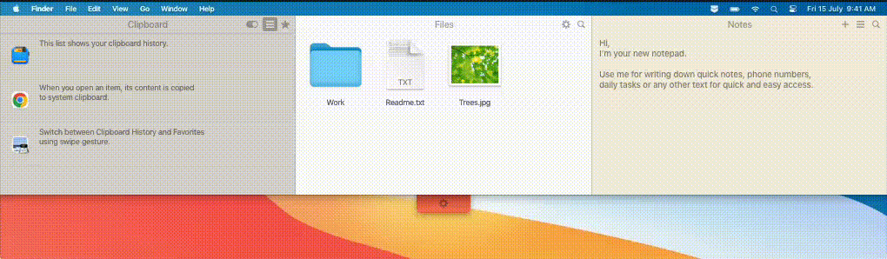
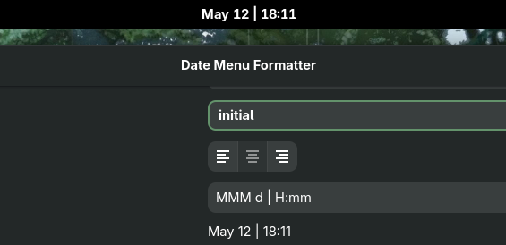
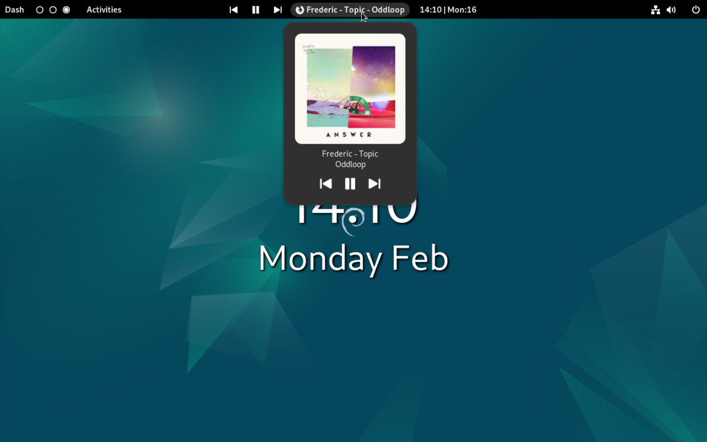
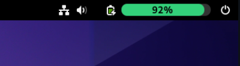

#+TITLE: Proyecto LIDSoL's Tweaks
#+DATE: 2026-08-25
* Objetivos generales
Diseñar, implementar y mantener una extensión modular para GNOME que modernice y re-interprete los componentes de extensiones obsoletas como [[https://extensions.gnome.org/extension/5338/aylurs-widgets/][Aylur's Widgets]] mediante una arquitectura que facilite el mantenimiento, adaptable a los cambios de API de GNOME Shell y GJS.
- Garantizar compatibilidad total con GNOME 50 y GNOME 51.
- Hacer los cambios necesarios para que los componentes sean estrictamente modulares.
- Separar estrictamente la lógica de negocio de la capa de presentación.
- Implementar Lazy Loading de módulos.
- Diseñar e implementar un framework modular interno; consolidad un backend reusable y extensible.
- Diseñar un backend MPRIS unificado y extensible.
- Validad consumo de CPU y memoria mediante profiling.
- Optimizar el rendimiento y evita degradación en animaciones del shell.
- Documentar formalmente la arquitectura interna y contratos entre módulos.
- Reducir listeners globales innecesarios y evitar memory leaks.
- Minimizar conflictos con extensiones populares.
- Publicar la extensión.
* Objetivos específicos
** NEXT 0. Docs y README
*** TODO [#A] Escribir un README.org con todas las features de la extensión
DEADLINE: <2026-10-05 Mon>
** TODO [#B] 1. Herramientas [0%]
*** TODO [#A] 1.1 Dashboard [0%]
DEADLINE: <2026-10-08 Thu>
- [ ] 1.1.1 Fix o Feat en Configuraciones [0/11]
  - [ ] 1.1.1.1 La configuración del offset en `X` y `Y` no funcionan correctamente. No se aplica el ajuste.
  - [ ] 1.1.1.2 Al activar el switch de /Transparent Container/, sería interesante cambiar el color background de los widgets. Pues el color no es muy agradable.
  - [ ] 1.1.1.3 Verificar el funcionamiento del ajuste /Grid Layout -> Columns/
  - [ ] 1.1.1.4 Verificar el widget indicador de "Show Temperature" ¿qué dependencia requiere para su correcto funcionamiento? Indicarlo para el /readme/.
  - [ ] 1.1.1.5 En /Media Player -> Prefer/: Evaluar la funcionalidad de esta ajuste. Podría ser bueno eliminar esta opción y todo su código asociado.
  - [ ] 1.1.1.6 En /Media Player/: El slider debe funcionar, arrastrar el indiciador nos lleva a ese instante en la pista. Debe funcionar en los reproductores locales (terminal, GUI nativos, flatpak y web).
  - [ ] 1.1.1.7 En /Media Player/: el slider debe funcionar en GSConnect. Arrastrar el indicador nos lleva a ese instante en la pista.
  - [ ] 1.1.1.8 En /Clock/ el Time Size debe estar en un rango de [20,70]
  - [ ] 1.1.1.9 En /Clock/: Al hacer click en el reloj se debe lanzar gnome-clocks, debe ser configurable para el usuario para seleccionar otro programa. Similar al comportamiento de Command en System Levels.
  - [ ] 1.1.1.10 Settings & System: Las opciones de System deben mantenerse intactas. Pero hay que modificar Settings, para que estén en este orden y tengan:
    - Settings (abrir los ajuste en general).
    - Wi-Fi (abrir los ajustes de wi-fi)
    - Bluetooth (abrir los ajustes de bluetooth)
    - Night Ligth (activar y desactivar la luz nocturna)
    - Dark Style (activar y desactivar el modo oscuro)
    - Do Not Disturb (activar y desactivar el modo do not disturb)
  - [ ] 1.1.1.11 Ajuste en /System Levels/ para mostrar porcentaje o uso de recurso.
- [ ] /1.1.2 Prefs.js/ [0/2]
  - [ ] 1.1.2.1 Cambiar los schemas para tener una buena configuración por defecto.
  - [ ] 1.1.2.2 Las configuraciones debe estar dentro del módulo, para ir reduciendo el tamaño de `prefs.js`.
*** TODO [#B] 1.2 Quick Text [0%]
DEADLINE: <2026-10-09 Fri>
- Descripción y objetivo:
  - Un atajo de teclado (Super+i predeterminado, pero es configurable) abre una ventana de dialogo desde la cual podemos escribir contenido que se insertará en algún archivo de texto plano de nuestra preferencia, podemos configurar un prefijo o sufijo al texto insertado. Es útil para tomar notas rápidas, fragmentos de texto y anotar ideas, puede usarse como complemento a cualquier app de notas basada en texto plano. El nombre y la ruta de acceso al archivo de destino deben establecerse antes de utilizar la extensión y el archivo debe existir.
  - Se usa como base el código de la extensión *Quick Text* de *Brainstormtrooper*. Esta extensión es compatible hasta GNOME 47, por lo que será necesario darle mantenimiento para darle compatibilidad con GNOME 50 y 51.
    - [[https://github.com/brainstormtrooper/quicktext][QuickText (GitHub)]]
    - [[https://extensions.gnome.org/extension/5892/quick-text/][QuickText (Extension.Gnome)]]
  - La /primera versión/ será solamente adaptar y actualizar a GNOME 50 QuickText, pero, posteriormente sería interesante implementar algo similar a [[https://unclutterapp.com/][unclutter]]:
  - Para ello, se puede tomar como base la extensión [[https://github.com/boerdereinar/copyous][copyous]].

- [ ] 1.2.1 Fix o Feat en configuraciones [0%]
  - [ ] 1.2.1.1: Mejoras en el selector de archivo
    - [ ] 1.2.1.1.1: Crear un archivo por defecto.
    - [ ] 1.2.1.1.2: Mejorar el selector del archivo. No mostrar solo la ruta, si no un selector de archivo.
    - [ ] 1.2.1.1.3: Manda una notificación si no encuentra el archivo.
- [ ] 1.2.2 Bug: Al abrir la ventana de Actions, no se ve el texto de las notas, se requiere hacer resize a la ventana para que recien ahí se vea el contenido.
- [ ] 1.2.3 Feat: Implementar una acción en el botón de calendario de Actions.
  - [ ] 1.2.3.1: Al pulsar el botón de calendario (new event), por defecto, abre el calendario (gnome-calendar), creando un evento usando el texto de la nota como título del evento.
  - [ ] 1.2.3.2: Adicionalmente, en los ajustes, se debe poder cambiar la acción de New Event, se debe configurar un comando bash, esta será una acción personalizada (puede ser útil para mover el texto a otro archivo, crear un evento en ikhal u otro calendario basado en terminal, etcétera). Se pasa como input el texto de la nota seleccionada al comando.
  - [ ] 1.2.3.3: Añadir un botón para añadir una tarea (por defecto Errands, pero puede personalizarse)
- [ ] /1.2.4 Prefs.js/ [0/2]
  - [ ] 1.2.4.1 Cambiar los schemas para tener una buena configuración por defecto.
  - [ ] 1.2.4.2 Las configuraciones debe estar dentro del módulo, para ir reduciendo el tamaño de `prefs.js`.
*** TODO [#C] 1.3 Launcher [0%]
DEADLINE: <2026-10-09 Fri>
- [ ] 1.3.1 [0/2] En la sección Overview, añadir un nuevo ajuste, en un Combo Row, añadir:
  - [ ] 1.3.1.1: Animación actual. Es el espacio de trabajo del overview "baja".
  - [ ] 1.3.1.2: Animación nativa. Solo "Fade".
- [ ] 1.3.2 [0/2] Feat: Implementar comandos personalizados al estilo /gnofi/.
  - [ ] 1.3.2.1: Reducir el tamaño de la fuente del nombre del comando. Está en negrita y con un tamaño muy grande.
  - [ ] 1.3.2.1: Cambiar el ícono de la sección de comandos en la búsqueda.
- [ ] /1.3.3 Prefs.js/ [0/2]
  - [ ] 1.3.3.1 Cambiar los schemas para tener una buena configuración por defecto.
  - [ ] 1.3.3.2 Las configuraciones debe estar dentro del módulo, para ir reduciendo el tamaño de `prefs.js`.
- [ ] 1.3.4 Quitar la leyenda actual "Type to search" y en su lugar, al hacer el atajo de teclado, simplemente volver a mostrar la barra de búsqueda si es que estaba oculta
*** SOMEDAY [#C] 1.4 Unclutter be like
 Basado en unclutter y copyus
- Se debe abrir con un atajo de teclado o un hot point como en overview.
- Se tienen tres vistas:
  - Clipboard
    - Se muestra la imagen, color (hexa, rgb)
    - Se puede editar el texto
  - Files
    - Debería poderse arrastrar archivos y directorios a la vista de archivos. Y a la inversa. Tomar desde la vista de archivos y arrastrarlo a, por ejemplo, arrastrar un archivo de esta sección al navegador, libre office, nautilus.
  - Notes.
    - Esta sección tiene tres botones: añadir, vista general y buscar
    - Por defecto muestra la última nota o la vista general.
    - Al añadir una nueva nota (botón) puedes escribir y añadirla (quicktext).
** TODO [#C] 2. Quick Settings [100%]
DEADLINE: <2026-09-28 Mon>
- [ ] 2.2.0: Cambiar los schemas para tener una buena configuración por defecto.
*** DONE [#C] 2.1 Avatar de usuario.
DEADLINE: <2026-10-08 Thu>
*** DONE [#C] 2.2 System Items Layout [2/2]
DEADLINE: <2026-09-21 Sat>
- [X] 2.2.1: Los elementos deben organizarse mediante "drag and drop" y no mediante botones, símil al organizador de elementos del top bar (implementado en los commits 7e16ea5, e09fc44, 9a3444b y 5025bfa.
- [X] 2.2.2: Las configuraciones del módulo viven en `extension/modules/quickSettingsTweaks/prefsSettings.js` (y el Avatar en `userAvatar/prefsSettings.js`), delegando desde `prefs.js`.
*** DONE [#C] 2.3 Quick Toggles Layout [8/8]
DEADLINE: <2026-09-21 Sat>
- [X] 2.3.1 Los elementos deben organizarse mediante "drag and drop" y no mediante botones, símil al organizador de elementos del top bar (implementado en los commits 7e16ea5, e09fc44, 9a3444b y 5025bfa.
- [X] 2.3.2 Testing de las reglas de coincidencia: Constructor name, Regex de título, GTYpe name.
- [X] 2.3.3 Añadir la posibilidad de colocar opciones a los quick (por ejemplo, en caffeine, independiente al botón, hay una flecha que despliega un menú dentro del toggle que permite controlar el tiempo de pantalla activa). Se deben poder añadir estas opciones, cada una puede ser un argumento al script.
- [X] 2.3.3 Añadir toggles personalizados pre-configurados:
  - [X] 2.3.3.1 Remplazo a "caffeine"
  - [X] 2.3.3.2 Syncthing
- [X] 2.3.4 El Switch de "Otros Toggles" también oculta los toggles personalizados que el usuario configura. Esto no debería suceder.
- [X] 2.3.5 Fix a *Opciones de menu* de Quick Toggles Layouts.
- [X] 2.3.6 Fix: Parece que al pulsar el botón, este actúa dos veces.
- [X] 2.3.7 Feat: Agrupación de los comandos "Opciones de menú", para cambiarlos de posición.
*** DONE [#C] 2.4 Overlay Mode
DEADLINE: <2026-09-22 Tue>
- [X] 2.4.1 Overlay mode de QST: port de QST `OverlayMenu` en `extension/modules/quickSettingsTweaks/overlayMenu.js` (overlay flotante fijado al toggle con BindConstraints X/Y → `_boxPointer`; desactiva los constraints nativos de posición y del placeholder del grid; animación `flyout`/`dialog` con bezier custom y duración configurable; ancho configurable). Opciones en el dialog (grupo "Overlay Mode" en `prefsSettings.js`). Claves `qst-overlay-menu-*` en el schema.
- [X] 2.4.2 Animaciones de QST: port de QST `MenuAnimation` en `extension/modules/quickSettingsTweaks/menuAnimation.js` (blur del boxPointer + ease de escala/opacidad del menú y opacidad del grid en open/close). Opciones en el dialog (grupo "Animation" + dialog "Estilo avanzado de animación"). Claves `qst-menu-animation-*` en el schema.
- El acordeón "banda esencial" (antiguo 2.4.1.1, regreso fallido del overlay + fade) queda APARCADO para futuras versiones y su código fue sustituido por el port de QST en `overlayMenu.js`. Las lecciones de perf quedan como referencia en este archivo.
** TODO [#B] 3. Widgets [0%]
*** TODO [#B] 3.1 User Avatar (date menu)
DEADLINE: <2026-10-05 Mon>
- [ ] 3.1.1 Eliminar este widget, opciones y todo código asociado. Pero tomar notas sobre como insertar elementos en esta sección del date menu, puede resultar útil después.
*** TODO [#A] 3.2 Date Menu Media Widget
DEADLINE: <2026-10-10 Sat>
- [ ] 1.3.1.2 Bug: De vez en cuando, aparece la leyenda "No Notifications" en el Date Menu, incluso aunque sí hayan notificaciones, provocando que estas se superpongan a la leyenda; no sucede todo el tiempo, aparece la leyenda sin "razón aparente" y luego nunca desaparece, incluso si las extensiones son desactivadas; esto también hace que el botón "Borrar todo" no sea visible.
- [ ] 1.3.1.3 Mejoras en el widget de Multimedia
  - [ ] 1.3.1.3.1 La barra de progreso avanza cada 3 segundos, sería bueno ver una animación de desplazamiento del indicador, para no ver un avance brusco.
  - [ ] 1.3.1.3.2  Cuando se cambia de medio gracias al switch, la barra de progreso se muestra en 0 y después avanza hasta el estado tiempo real de producción. También se debe implementar la animación de avance en este caso, para evitar "ese cambio brusco"
  - [ ] 1.3.1.3.3 Mejoras en MPRIS
- [ ] 3.1.1.4 Ocultar caja derecha (quick settings tweaks referencia)
- [ ] 3.1.1.5 Ocultar caja izquierda (quick settings tweaks referencia)
- [ ] 3.1.1.6 Permutar caja derecha e izquierda (aylur's referencia)
- [ ] 3.1.1.7 mediaPlayer.js está spameando en el journal.
*** TODO [#B] 3.3 Desktop Widgets
DEADLINE: <2026-10-10 Sat>
- [ ] 1.3.3.1 Dividirlo en tres áreas: Date Menu widget, Quick Settings Widgets y Background Widgets. Usar un grid, el widget puede ocupar una "celda/coordenada" dentro de ese grid. Si un widget ya lo ocupa, no es posible colocar otro más para evitar superposición.
***** TODO 1.3.3.1 Animación fade.
DEADLINE: <2026-09-15 Tue>
Implementar una animación fade al pasar del desktop al overview, para que la transición no sea tan brusca. Para ello puedes estudiar la extensión "/desktop-icons-ng/", que muestra íconos en el escritorio, y ya implementa la animación que buscamos.
***** TODO 1.3.3.2 Widget Picture
DEADLINE: <2026-09-15 Tue>
***** SOMEDAY Widget clock
- Referencia para el frontend: [[https://flathub.org/en/apps/re.sonny.Retro][Widget clock]]
***** SOMEDAY Widget multimedia
- Referencia para el frontend: [[https://flathub.org/en/apps/dev.geopjr.Turntable][Turntable (media widget flatpak)]]
***** SOMEDAY Widget weather
- Referencia para el frontend: [[https://flathub.org/en/apps/io.github.amit9838.mousam][Mouseam en "modo widget"]]
** NEXT [#B] 4. Top Bar [0%]
*** TODO [#C] 4.1 Top Bar Organized [0%]
DEADLINE: <2026-10-05 Mon>
- [-] 4.1.0 /Prefs.js/
  - [X] 4.1.0.1 Mover los ajustes de /Prefs.js/ a un archivo de configuración en el directorio del módulo.
  - [ ] 4.1.0.2 Cambiar los schemas para tener una buena configuración por defecto.
- [x] 4.1.1 Bug: Al hacer uso del botón "Restablecer valores predeterminados" todos los elementos /desaparecen/, al cerrar y abrir el dialog, nuevamente son visibles. No se restablece el orden.
- [x] 4.1.1 Feat: Al hacer uso del botón "Restablecer valores predeterminados", recargar los elementos del panel, para eliminar aquellos que ya no están. Por ejemplo, a veces permanecen en la lista elementos que ya no existen; como un indicador de una extensión que ya se eliminó, pero el elemento aún se muestra. Solución: el botón ahora "limpia la barra": vía D-Bus (`org.gnome.Shell.Extensions.LidSolWidgets.CleanTopBar`) pide al módulo `_cleanTopBar()` que reconstruya los `tbo-*-box-order`/`tbo-hide`/`tbo-show` únicamente con los elementos vivos de la barra, y luego el dialog se reconstruye.
- [x] 4.1.3 Feat: Cada vez que se abre el dialog, recarga los elementos (para asegurar que no se muestra nada que no está realmente). Solución adoptada: limpieza **manual** vía el botón de actualizar (1.4.1.1); NO se poda automáticamente en cada evento (prefs no accede a `Main.panel`, así que la limpieza se delega al módulo del shell vía D-Bus).
- [x] 4.1.4 Bug: Este tiene relación con 4.3.1, no se puede "ordenar" el elemento del Workspace Bar. Muy posiblemente por entrar en conflicto con la opción de ubicación de este módulo. No aparece en la lista de elementos a ordenar.
- [x] 4.1.5 Feat: Recibe la señal de como se indica en 4.3.5.8; es decir, estos dos switch están sincronizados, se usa la función/clase de Top Bar.
*** TODO [#C] 4.2 Panel Corners [0%]
DEADLINE: <2026-10-05 Mon>
- [ ] 4.2.1 Eliminar el modo debug (switch) de las opciones avanzadas, y todo el código asociado a esta opción.
*** TODO [#B] 4.3 Workspace Indicator [0%]
DEADLINE: <2026-10-05 Mon>
- [x] 4.3.1 Eliminar las opciones de posición y todo su código asociado (se usará top bar organized para ello).
- [x] 4.3.2 Bug: No se muestra en top bar organized (relacionado con 1.4.1.4)
- [x] 4.3.2 Feat: Implementar la posibilidad de renombrar el espacio de trabajo (como en space bar).
- [ ] 4.3.3 Añadir la posibilidad de arrastrar un elemento del topbar a un espacio de trabajo o un lugar intermedio para abrir un nuevo espacio de trabajo.
- [x] 4.3.4 Movimiento de workspaces como en workspaceIndicator
- [x] 4.3.5 Opciones de *Comportamiento*
  - [x] 4.3.5.1 Mostrar iconos de las aplicaciones (este switch debe mostrar u ocultar los iconos, para solo mostrar los nombres de los espacios de trabajo)
  - [x] 4.3.5.2 Click central cierra ventana (opción por defecto)
  - [x] 4.3.5.3 Mostrar números siempre
  - [x] 4.3.5.4 Scroll vertical (normal, invertido, desactivado)
  - [x] 4.3.5.5 Scroll horizontal (normal, invertido, desactivado)
  - [x] 4.3.5.6 Rueda del ratón (sobre el panel, sobre el indicador, desactivado)
  - [x] 4.3.5.7 Debounce
  - [x] 4.3.5.6 Tiempo de debounce
  - [x] 4.3.5.8 Conservar indicador nativo (cuando se activa este módulo, manda un mensaje a top bar organized para ocultarlo). Relacionado con 1.4.1.5
  - [x] 4.3.5.9  Mostrar espacios vacíos (+) (adaptarlo de space bar)
- [x] 4.3.6 Opciones de *Nombres inteligentes*
  - Feat basada en space bar
  - [x] 4.3.6.1 Activar nombres inteligentes
  - [x] 4.3.6.1 Reevaluar nombres
- [x] 4.3.7 Opciones de *Apariencia*
  - [x] 4.3.7.1 Tamaño (opción por defecto)
  - [x] 4.3.7.2 Reducir opacidad de iconos nativos (opción por defecto)
  - [x] 4.3.7.3 Desaturar iconos inactivos (opción por defecto)
  - [x] 4.3.7.4 Habilitar animaciones (opción por defecto)
  - [x] 4.3.7.5 Efecto de escala de enfoque (opción por defecto)
  - [x] 4.3.7.6 Cantidad de reducción (opción por defecto)
  - [x] 4.3.7.7 Animación de transición (desvanecer, latido, deslizado+fundido, ninguna)
  - [x] 4.3.7.8 Padding de barra
  - [x] 4.3.7.9 Margen entre espacios
  - [x] 4.3.7.10 Mostrar fondo de iconos (opción por defecto)
- [x] 4.3.8 Opciones de *Espacio activo*
  - [x] 4.3.8.1 Usar color de acento de GNOME en el fondo (nombre e icono, en el fondo del icono debe usarse un color más oscuro para mejorar el contraste)
  - [x] 4.3.8.2 Usar color de acento de GNOME en el borde
  - [x] 4.3.8.3 Color de fondo
  - [x] 4.3.8.4 Color de texto
  - [x] 4.3.8.5 Color de borde
  - [x] 4.3.8.6 Color de fondo de iconos
  - [x] 4.3.8.8 Grosor de fuente (nombre)
  - [x] 4.3.8.9 Radio de borde
  - [x] 4.3.8.10 Ancho de borde
  - [x] 4.3.8.11 Padding horizontal
  - [x] 4.3.8.12 Padding vertical
- [x] 4.3.9 Opciones de *Espacio inactivo*
  - [x] 4.3.9.1 Color de fondo
  - [x] 4.3.9.2 Color de texto
  - [x] 4.3.9.3 Color de borde
  - [x] 4.3.9.4 Color de fondo de iconos
  - [x] 4.3.9.6 Grosor de fuente (nombre)
  - [x] 4.3.9.7 Radio de borde
  - [x] 4.3.9.8 Ancho de borde
  - [x] 4.3.9.9 Padding horizontal
  - [x] 4.3.9.10 Padding vertical
- [x] 4.3.10 Opciones de *Espacio vacío*
  - [x] 4.3.10.1 Color de fondo
  - [x] 4.3.10.2 Color de texto
  - [x] 4.3.10.3 Color de borde
  - [x] 4.3.10.4 Color de fondo de iconos
  - [x] 4.3.10.6 Grosor de fuente (nombre)
  - [x] 4.3.10.7 Radio de borde
  - [x] 4.3.10.8 Ancho de borde
  - [x] 4.3.10.9 Padding horizontal
  - [x] 4.3.10.10 Padding vertical
- [ ] 4.3.11 Opciones de *Atajos de teclado*
  - [ ] 4.3.11.1 Super + 1, ..., 0 (Switch to workspace)
  - [ ] 4.3.11.2 Ir y volver
  - [ ] 4.3.11.3 Super + Shift + 1, ..., 0 (Move windows to workspaces ...)
  - [ ] 4.3.11.4 Mover espacio a la izquierda
  - [ ] 4.3.11.5 Mover espacio a la derecha
  - [ ] 4.3.11.6 Volver al espacio anterior
  - [ ] 4.3.11.7 Ir al espacio vacío
  - [ ] 4.3.11.8 Abrir menú (para renombrar)
- [x] Configuración para el acento de color, si se muestra los iconos, el color difiere del bg al borde, si no se muestran los iconos, se usa el color del acento tanto en borde como bg.
- [ ] Deshabilitar las opciones referentes a iconos si el switch para mostrarlos está desactivado.
- [ ] Bug en múltiples monitores, no aparece el workspace de los monitores externos.
- [ ] Cuando se tienen los íconos activos, el bg que difiere del borde también debe aplicar a los indicadores de espacio de trabajo que no tiene aplicaciones abiertas. Cuando te colocas en un espacio de trabajo sin iconos, el borde y el bg son iguales.
- [ ] Configurar las opciones predeterminadas.
- [ ] No se muestran múltiples monitores.
*** NEXT [#A] 4.4 Date Menu Tweaks [0%]
DEADLINE: <2026-10-10 Sat>
- Descripción y objetivo: Basado en el widget [[https://support.google.com/android/answer/14883154][At a Glance]] de los Google Pixel; el texto del /Date Menu/ cambia dinámicamente, muestra contenido multimedia en reproducción, muestra un contrador de notificaciones, etcétera.
***** TODO [#C] 4.4.1 Date Menu
DEADLINE: <2026-09-26 Sat>

- Descripción y objetivo: Permite personalizar el formato de fecha y hora en el panel.
  - Aylur's Widget tiene un componente que permite personalizar esto, también se tomará como referencia el código de la extensión [[https://extensions.gnome.org/extension/4655/date-menu-formatter/][Date Menu Formatter de Marcin Jakubowski]]. Esta última compatible hasta GNOME 50, por lo que no debería ser difícil integrarla.
- [ ] 4.4.1.1 Bug: Habilitar la opacidad en ./Gnome-Extensions/extension/modules/dateMenu/dateMenu.css; las primeras 14 líneas de este archivo desactivan la opacidad predeterminada en hover y active, esto con el objetivo de no superponer la opacidad nativa con la de /at-a-glance/. En teoría, con las líneas 20 a 32 debería de añadirse la opacidad en el Hover y Active, pero no está funcionando correctamente.
- [ ] 4.4.1.2 Bug: Espacio anómalo a un lado del date menu (top bar, hora) al iniciar sesión (parece reservar espacio para el visualizador y la carátula). El relleno se normaliza tras reproducir y pausar cualquier medio (después de mostrar información multimedia).
***** TODO [#B] 4.4.2 Progress Day
DEADLINE: <2026-10-10 Sat>
- Descripción y objetivo: Usando como base [[https://github.com/ArcaEge/day-progress][Day progress de ArcaEge]], añadir una barra o círculo de progreso en el date menu (no debe ser un elemento añadido, debe estar dentro el date menu, así como el indicador multimedia). Este remplaza o complementa la hora/fecha.
- Esto puede que interfiera con la disposición (vista multimedia, vista reloj, vista reloj+multimedia). Así que hay que tener cuidado de no romper estas opciones. Si se prefiere la barra de progreso como remplazo del reloj (texto), se deben comportar igual la multimedia, pero en vez de mostrar el texto, mostrar la barra o barras.
- [ ] 4.4.2.1 En las opciones de Top Bar -> Date Menu; añadir arriba de "Multimedia" y debajo de "Formatos" las opciones de Progress Day. Las opciones a añadir:
    - [ ] Comportamiento
      - [ ] Combo Row con:
        - No mostrar barra(s)/círculo(s) de progreso.
        - Mostrar barra(s)/circulo(s) de progreso junto con el reloj.
        - Solo mostrar la barra(s)/circulo(s), remplazando el reloj/fecha (texto). Si esta opción está seleccionada, se deben bloquear los ajustes de formatos.
    - [ ] Apariencia
        - Time Elapsed
        - Show Year Progress
        - Show Life progress
        - Eliminar u omitir la opción "Stack Direction", y que siempre sea horizontal (siempre se desbordan en vertical)
    - [ ] Start Time, Reset Time, Year start date, life span.
***** TODO [#A] 4.4.3 Media Player
DEADLINE: <2026-10-10 Sat>

- Descripción y objetivo: Información de reproducción multimedia integrada en el Date Menu.
  - Para usar como base, se pueden tomar en cuenta todas las siguientes implementaciones:
    - [[https://extensions.gnome.org/extension/4928/mpris-label/][Media Label and Controls (por moon-0xff)]], compatible hasta GNOME 49.
    - [[https://extensions.gnome.org/extension/9334/dynamic-music-pill/][Dynamic Music Pill (por andbal)]], compatible hasta GNOME 50.
    - [[https://extensions.gnome.org/extension/4470/media-controls/][Media Controls (por Sakith B.)]], compatible hasta GNOME 49.
    - [[https://extensions.gnome.org/extension/9184/advanced-media-controller/][Advanced Media Controller (por sanjai)]] compatible hasta GNOME 50.
- [ ] 4.4.3.1 ¿Crossfade por capas CSS?
***** TODO [#B] 4.4.4 Notifications Indicator
DEADLINE: <2026-09-26 Sat>
Punto indicador se desplaza cuando hover. Por modificaciones en la apariencia.
*** TODO [#B] 4.5 Battery Indicator [50%]
DEADLINE: <2026-10-10 Sat>

- Descripción y objetivo: Indicador alternativo de batería en el Top Bar.
  - Se toma como base uno de los módulos de Aylur's Widgets. Compatible hasta GNOME 44, por lo que será necesario darle mantenimiento para hacerlo compatible con GNOME 50.
- Configuración:
  - Visibilidad de ícono y porcentaje.
  - Dimensiones.
  - Colores dinámicos configurables (batería baja, cargando, normal)
- [X] 4.5.1 "Incrustar" la barra/circunferencia en el system indicator, por ahora es un "elemento más" añadido a la barra.
- [ ] 4.5.2 Configuraciones
*** TODO [#B] 4.6 System Indicador
DEADLINE: <2026-10-10 Sat>
- Tomando como referencia Quick Settings Tweaks, implementar:
- [ ] 2.5.1 Ordering and hiding: posibilidad de reordenar y ocultar los indicadores del sistema
  - No debe interferir con el elemento 4.4.7 (battery indicator); debe ser un elemento más.
  - Reorganización mediante switch y drag and drop
- [ ] 2.5.2 Accent Screen sharing indicador: Posibilidad de usar el color de acento en el indicador de "compartiendo pantalla"
- [ ] 2.5.3 Accent screen recording indicator: Posibilidad de usar el acento de color en el indicador "grabando pantalla".
- [ ] 2.5.4 Privacy indicator style: Default, accent, monochrome.
- [ ] 2.5.5 /Prefs,js/
  - [ ] 2.5.5.1 Cambiar los schemas para tener una buena configuración por defecto.
  - [ ] 2.5.5.2 Cambiar los schemas para tener una buena configuración por defecto.
- Si en el futuro, como se indica en [[https://blogs.gnome.org/shell-dev/2026/08/11/gnome-shell-design-dreams/][el blog de GNOME SHELL & Mutter]], el widget de multimedia se mueve a los quicksettings: se moverá el visualizer y album art a los System Indicators.
** NEXT [#A] 5. General [50%]
DEADLINE: <2026-10-04 Sun>
*** DONE 5.1 Multi-idioma
DEADLINE: <2026-10-03 Sat>
*** NEXT [#A] 5.2 Backend MPRIS [4/5]
DEADLINE: <2026-10-04 Sun>
- [X] 5.2.1 Mejorar y corrección de bugs del MPRIS
- [X] 5.2.1.1 No todos los reproductores de música son aceptados.
- [X] 5.2.1.2 Agrupar todos los reproductores de una misma fuente con un Expand Row
- [X] 5.2.1.3 Filtro aplicado al instante en todos los consumidores (dateMenu/AtAGlance, dateMenuMedia, dashboard)
- [X] 5.2.1.4 Mejoras en la obtención del album art, incluida la carátula negra al desbloquear (solo en el at-a-glance). Decisiones en [[file:docs.org][docs.org]] ("Decisiones de arquitectura") y lección en [[file:notesReferences.org][notesReferences.org]] ("Lecciones de Album Art (capas CSS)").
  - [ ] 5.2.1.4.1 Pendiente: segundo problema de CSS del at-a-glance (aplazado a propósito en esta tanda, sin diagnosticar). El refinamiento del crossfade por capas está en 4.4.3.1.
  - [ ] 5.2.1.4.2 Bug: el handler de =screen-unlocked= del dateMenu anula =_lastCoverUrl= al principio. Si el reproductor no reporta carátula y tampoco hay =getLastKnownCover()=, un =_updateMedia= posterior puede terminar limpiando un art que estaba visible.
  - [ ] 5.2.1.4.3 Bug: =dateMenuMedia._updateGradient= lee =trackCoverUrl= crudo (solo =file://=), al margen del AlbumArt, así que con carátulas remotas o =data:= el degradado no se aplica.
